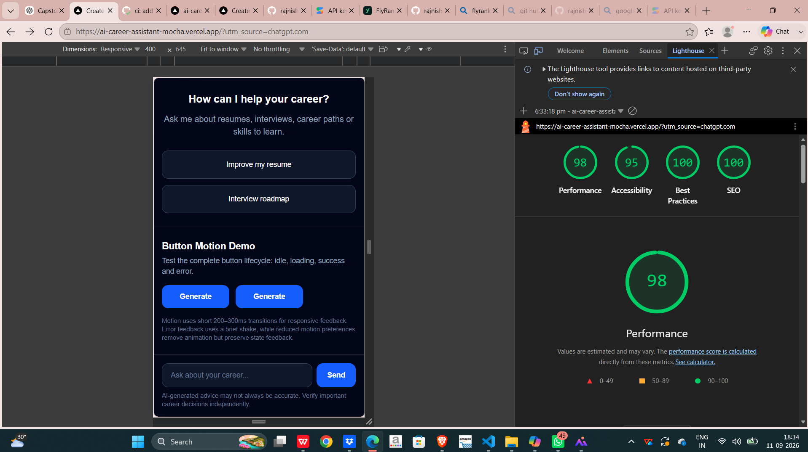
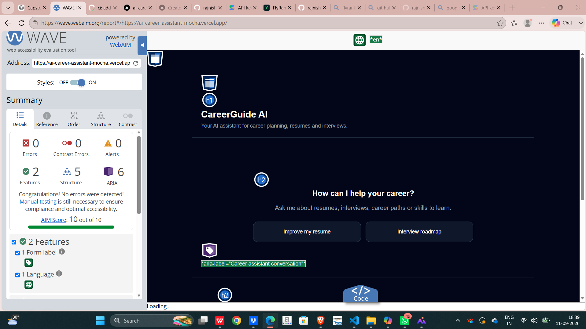

# Accessibility and Performance Audit

## Lighthouse Mobile Audit

### Results

- Performance: 98
- Accessibility: 95
- Best Practices: 100
- SEO: 100

## WAVE Accessibility Audit

### Results

- Errors: 0
- Contrast Errors: 0
- Alerts: 0
- AIM Score: 10/10

## Accessibility Improvements

- Added accessible labels for interactive controls.
- Added visible keyboard focus states.
- Added `aria-live` for AI response/status updates.
- Added a keyboard-reachable Stop button during streaming.
- Added an accessible error state with Retry.
- Tested the primary flow using keyboard navigation.
- Verified the responsive mobile layout.

## Performance Improvements

- Kept the application lightweight with a simple UI.
- Avoided unnecessary large assets.
- Tested the deployed application using Lighthouse Mobile.
- Verified the application at a mobile viewport.

## Final Results

| Audit | Result |
|---|---:|
| Lighthouse Performance | 98 |
| Lighthouse Accessibility | 95 |
| Lighthouse Best Practices | 100 |
| Lighthouse SEO | 100 |
| WAVE Errors | 0 |
| WAVE Contrast Errors | 0 |
| WAVE Alerts | 0 |
| WAVE AIM Score | 10/10 |

## Conclusion

The deployed CareerGuide AI application was audited for accessibility and performance. Lighthouse achieved scores above the recommended 90 target for performance and accessibility, while WAVE reported zero errors, zero contrast errors, and zero alerts.